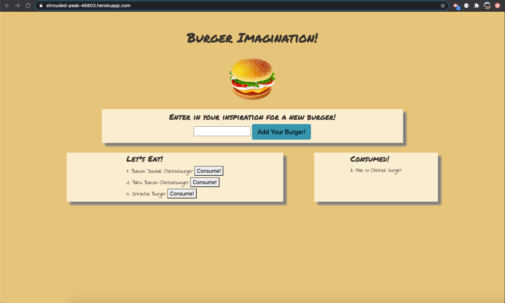

# Note Taker Homework 13   

## Introduction  

This assignment was given to create a burger logger using MySQL, Node, Express, Handlebars, and ORM. It was required to set up the MVC (Model View Controller) design. It uses Node, MySQL, and Express to route data. It used Handlebars to generate the HTML page. It was lastly deployed using Heroku.

## Table of Contents:  
* [Objectives](#Objectives)
* [Process](#Process)
* [Challenges](#Challenges)
* [Summary](#Summary)
* [Sites](#Sites)
* [Screenshot](#Screenshot)

## Objectives  

```md
Burger Imagination! is an app that lets users input a name of any burger they can conjure. When the user submits the burger, it is logged in the "Let's Eat" box. After they have eaten it, it then moves over to the "Consumed!" box so they know which burgers have and have not been eaten. The burgers are created, saved, and updated in MySQL.
```

## Process  

* I first copied the homework into my own repository for the assignment.  
* I then completed npm i installation into my repository. 
* Following the instructions in the initial markdown, I created the necessary files to ensure the MVC design.
* I then gathered some boilerplate code from assignments for the connections, controllors, and models.
* I then started building the database in MySQL to store information on the database.
* I then built the views tabs with handlebars to dynamically create the html page.
* I tested pages locally to ensure a functioning web page.
* I then connected the app to Heroku to get off the local server.  

## Challenges  

This assignment was very challenging for me. The layout of the MVC design was extremely daunting at first. It was confusing on how the connection page linked to the orm page which linked to the model file which linked to the controller. I had a hard time keeping everything straight as I went through the assingment. Slowly but surely it began making more sense and the html build was fine. It was getting the orm to work that was a massive struggle at first. The last big challenge was connecting to Heroku. I had struggles but eventually found out some syntax errors. In the end I got the project I envisioned!

## Summary  

This assignment was a huge challenge for me. The complexity of an orm, setting up all the different files, and how they all link together was very confusing. But once it started making sense, it was a fun assignment to see come together.

## Sites  

* [Link to repository on GitHub](https://github.com/j-midgley13/mvc-hw-13)

* [Link to deployed Heroku Website](https://shrouded-peak-46803.herokuapp.com/) 

## Screenshot  

  